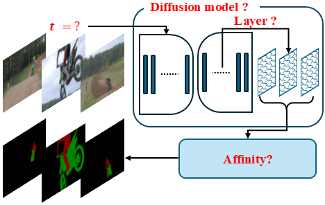

<div align="center">

## Studying Image Diffusion Features for Zero-Shot Video Object Segmentation  
<sub><i>CVPRW 2025 – IEEE/CVF Conference on Computer Vision and Pattern Recognition Workshops</i></sub>  
<br>
<strong>
  <a href="https://www.linkedin.com/in/thanos-delatolas">Thanos Delatolas</a> · 
  <a href="https://vicky.kalogeiton.info/">Vicky Kalogeiton</a> · 
  <a href="https://dimipapa.github.io/">Dim Papadopoulos</a>
</strong>  
<br>
<strong>
<a href="https://diff-zsvos.compute.dtu.dk/" style="text-decoration:none; background:#007acc; color:white; padding:6px 12px; border-radius:6px;"><b>Webpage</b></a> ·
<a href="https://arxiv.org/abs/2504.05468" style="text-decoration:none; background:#28a745; color:white; padding:6px 12px; border-radius:6px;"><b>Paper</b></a> 
</strong>



</div>
We leverage pre-trained diffusion models for Zero-Shot Video Object Segmentation by addressing key challenges: 

* selecting the appropriate <strong>diffusion model</strong>
* determining the optimal <strong>time step</strong>
* identifying the best feature extraction <strong>layer</strong>
* designing an effective <strong>affinity matrix</strong> calculation strategy to match the features

### Installation
```bash
conda create -n diff-zvos python=3.10.8
conda activate diff-zvos
conda install pytorch==2.1.0 torchvision==0.16.0 torchaudio==2.1.0 pytorch-cuda=11.8 -c pytorch -c nvidia
pip install -r requirements.txt
sh scripts/install_adm.sh
```

### Datasets
To download the datasets, run:
```bash
python scripts/download_datasets.py
```
To run inference please follow [EVALUATION.md](docs/EVALUATION.md). 

### Citation

### State-of-the-art Comparison in Zero-Shot Video Segmentation

| Model                     | #Images | #Segmentations (Image) | #Frames | #Segmentations (Video) | Datasets      | DAVIS-17 val |
|--------------------------|---------|-------------------------|---------|-------------------------|---------------|--------------|
| **Image + Video-level Data** |||||||
| XMem                     | 1.02M   | 27K                    | 150K   | 210K                   | I+S+D+Y       | 86.2         |
| Cutie                    | 1.02M   | 27K                    | 150K   | 210K                   | I+S+D+Y       | 88.8         |
| SAM2                     | 11M     | 1.1B                   | 4.2M   | 35.5M                  | SA+SAV        | **90.7**     |
| **Image-Level masks** |||||||
| SegIC                    | 1.3M    | 1.8M                   | ❌       | ❌                      | I+C+A+L       | 73.7         |
| SegGPT                   | 147K    | 1.62M                  | ❌       | ❌                      | C+A+V         | 75.6         |
| PerSAM-F                 | 11M     | 1.1B                   | ❌       | ❌                      | SA            | 76.1         |
| Matcher                  | 11M     | 1.1B                   | ❌       | ❌                      | SA            | **79.5**     |
| **No masks** |||||||
| FGVG                     | 1M      | ❌                     | 116K    | ❌                      | I+Y+FT        | 72.4         |
| STT                      | 1M      | ❌                     | 95K     | ❌                      | I+Y           | **74.1**     |
| STC                      | ✗       | ❌                      | 20M     | ❌                      | K             | 67.6         |
| INO                      | ✗       | ❌                      | 20M     | ❌                     | K             | 72.5         |
| Mask-VOS                 | ✗       | ❌                      | 95K     | ❌                      | Y             | **75.6**     |
| MoCo                     | 1M      | ❌                      | ❌       | ❌                      | I             | 65.4         |
| SHLS                     | 10K     | ❌                      | ❌       | ❌                      | M             | 68.5         |
| DIFT-SD                  | 5B      | ❌                     | ❌       | ❌                      | LN            | 70.0         |
| DINO                     | 1M      | ❌                     | ❌       | ❌                     | I             | 71.4         |
| DIFT-ADM                 | 1M      | ❌                      | ❌       | ❌                      | I             | 75.7         |
| Training-Free-VOS        | 1M      | ❌                     | ❌       | ❌                      | I             | 76.3         |
| **Ours** |||||||
| SD-2.1 + Prompt Learning | 5B      | ❌                      | ❌       | ❌                     | LN            | 70.5         |
| ADM + MAGFilter          | 1M      | ❌                      | ❌       | ❌                      | I             | **76.8**     |

### Acknowledgements
We would like to thank the authors of [DIFT](https://github.com/Tsingularity/dift), [DINO](https://github.com/facebookresearch/dino) and [Cutie](https://github.com/hkchengrex/Cutie) for making their code publicly available.

