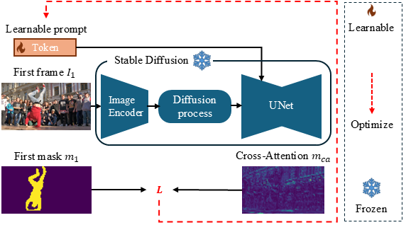

## Inference and Evaluation
The hyperparameters for the evaluation are set in the config files `src/configs/`. The segmentation masks will be saved in the `predictions` folder. You may also use the `exp_id` parameter to save the results in a different folder.

### General Arguments

Here are some of the useful argument options that are shared for all the evaluation scripts.
- **`exp_id=`**: (Optional) Specify the name of your experiment.

- **`dataset=`**: Specify the dataset to run inference on.  
    Available options:
    - `d17-val`
    - `d17-test`
    - `mose-val`

- **`model=`**: Specify the model to use.  
    Available options:
    - `sd1.2` to `sd1.5`
    - `sd2.1`
    - `adm`

- **`propagation_params.<paramname>`**: Set parameters for the propagation. Replace `<paramname>` with the specific parameter you wish to set:
    - `t`: Diffusion time step
    - `layer`: layer number of the UNet
    - `func`: function to calculate the affinity matrix. Available options: `cosine`(default), `l2`, `l1`


#### To run the evaluation for Stable Diffusion 2.1, run:
```bash
python src/eval_vos.py dataset=d17-val model=sd2.1
python src/eval_vos.py dataset=d17-test model=sd2.1
python src/eval_vos.py dataset=mose-val model=sd2.1
```

#### To run the evaluation for ADM, run:
```bash
python src/eval_vos.py dataset=d17-val model=adm propagation_params.t=30 propagation_params.layer=6
python src/eval_vos.py dataset=d17-test model=adm propagation_params.t=30 propagation_params.layer=6
python src/eval_vos.py dataset=mose-val model=adm propagation_params.t=30 propagation_params.layer=6
```

#### Prompt Learning with Stable Diffusion 2.1
<div align="center">
  
</div>

First, you need to learn the prompts for the model
```bash
python src/learn_prompts.py dataset=d17-val model=sd2.1
python src/learn_prompts.py dataset=d17-test model=sd2.1
python src/learn_prompts.py dataset=mose-val model=sd2.1
```

Then, you can run the evaluation for Prompt Learning with Stable Diffusion 2.1
```bash
python src/eval_vos_prompts.py dataset=d17-val model=sd2.1
python src/eval_vos_prompts.py dataset=d17-test model=sd2.1
python src/eval_vos_prompts.py dataset=mose-val model=sd2.1
```
### Oracle
To run the oracle evaluation where we filter out all FG-BG correspondences, run:
```bash
python src/eval_vos_oracle.py dataset=d17-val model=sd2.1
```
This will not run for MOSE and davis-test as the ground truth masks are not available.
